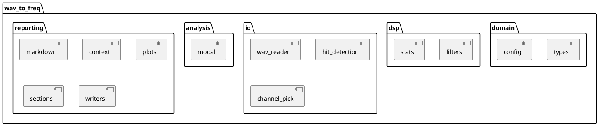

# Package architecture

## PlantUML Package Diagram

```plantuml
@startuml
allowmixing
package "wav_to_freq" {
  package "domain" {
    component "types"
    component "config"
  }
  package "dsp"  {
    component "filters"
    component "stats"
  }
  package "io" {
    component "wav_reader"
    component "hit_detection"
    component "channel_pick"
  }
  package "analysis" {
    component "modal"
  }
  package "reporting" {
    component "markdown"
    component "context"
    component "plots"
    component "sections"
    component "writers"
  }
}
@enduml
```
