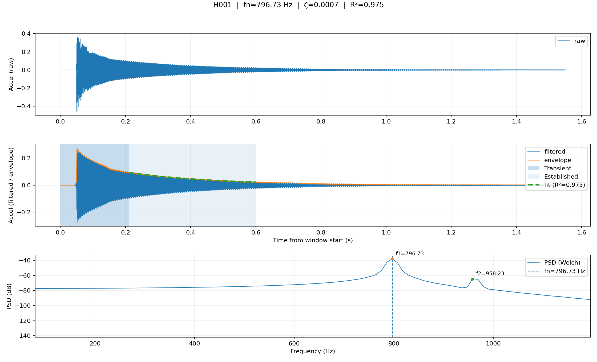
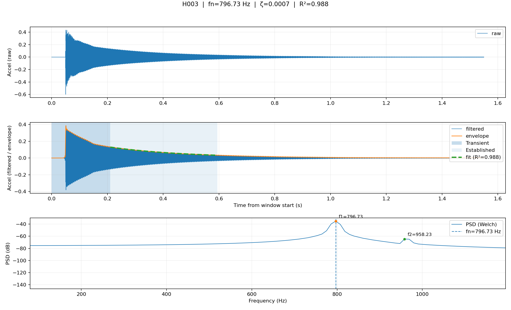
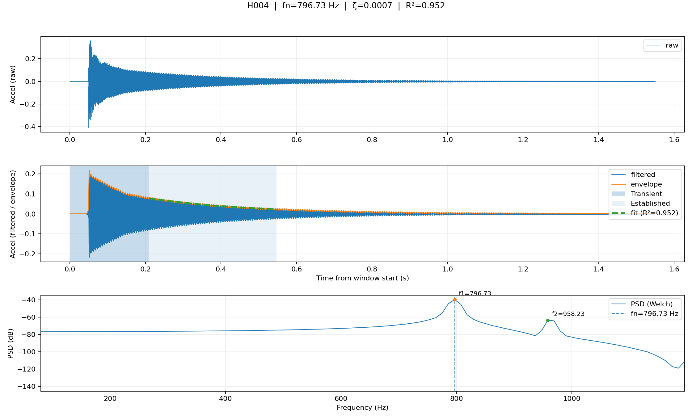
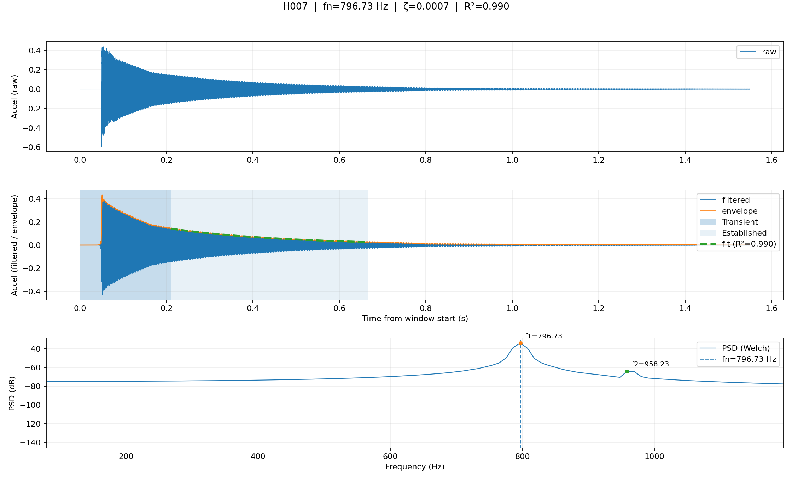
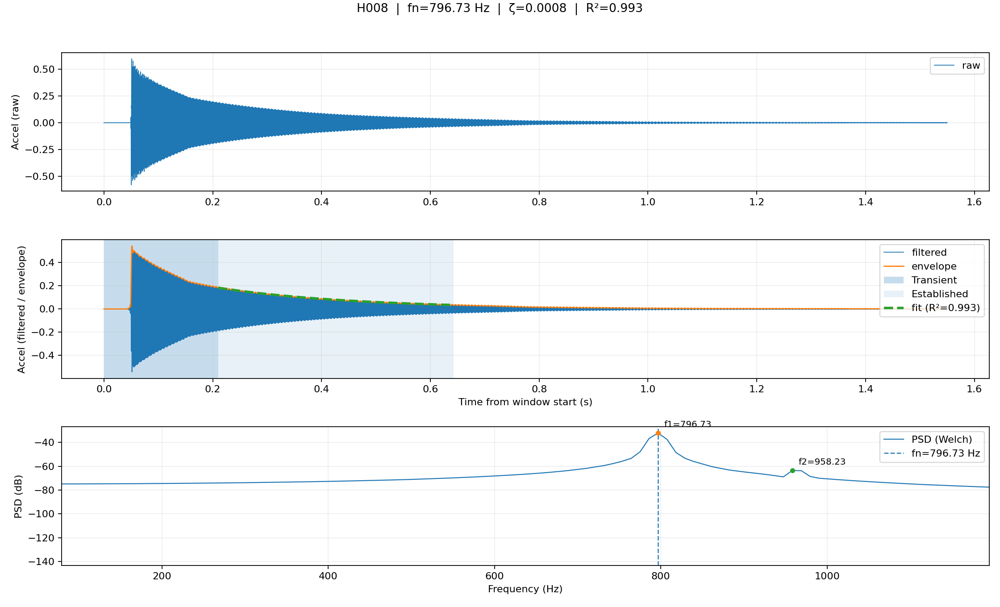
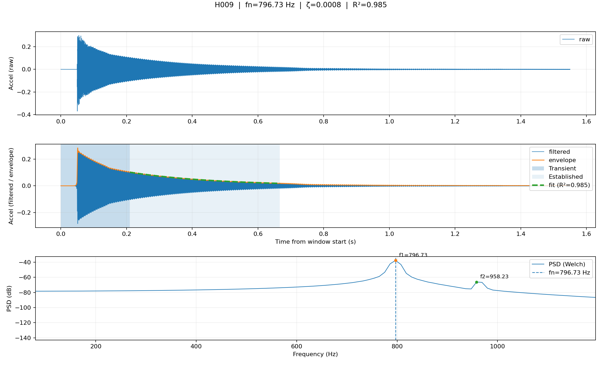
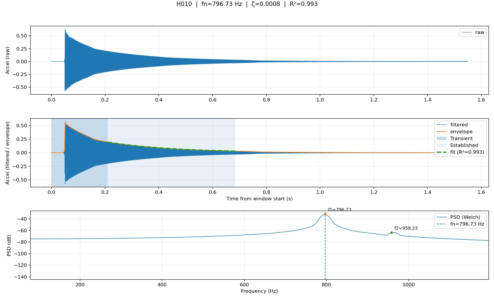

# Modal report

- Total hits: **10**
- Accepted: **10**
- Rejected: **0**

## Accepted summary

- fn (Hz): mean=796.729, min=796.729, max=796.729
- zeta: mean=0.000753, min=0.000717, max=0.000807
- SNR (dB): mean=27.31, min=25.00, max=30.45
- Envelope fit R²: mean=0.982, min=0.952, max=0.993

## Hit-by-hit

### H001

- fn=796.729 Hz
- zeta=0.000738
- SNR=26.80 dB
- R²=0.975

### H002

- fn=796.729 Hz
- zeta=0.000731
- SNR=26.42 dB
- R²=0.967

### H003

- fn=796.729 Hz
- zeta=0.000717
- SNR=25.66 dB
- R²=0.988

### H004

- fn=796.729 Hz
- zeta=0.000728
- SNR=25.00 dB
- R²=0.952

### H005

- fn=796.729 Hz
- zeta=0.000745
- SNR=25.56 dB
- R²=0.985

### H006

- fn=796.729 Hz
- zeta=0.000786
- SNR=27.22 dB
- R²=0.991

### H007

- fn=796.729 Hz
- zeta=0.000742
- SNR=28.91 dB
- R²=0.990

### H008

- fn=796.729 Hz
- zeta=0.000775
- SNR=28.34 dB
- R²=0.993

### H009

- fn=796.729 Hz
- zeta=0.000757
- SNR=28.74 dB
- R²=0.985

### H010

- fn=796.729 Hz
- zeta=0.000807
- SNR=30.45 dB
- R²=0.993

