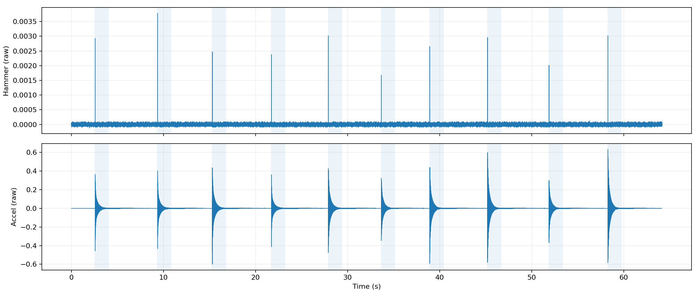

# WAV preprocessing report

## WAV file specs

| Field | Value |
| --- | --- |
| Path | /home/placerte/projects/ap_conf/260116-1.wav |
| Sample rate (Hz) | 44100.000 |
| Samples | 2828827 |
| Duration (s) | 64.145737 |
| Hammer channel | StereoChannel.LEFT |
| Autodetect method | kurtosis_hp200 |
| Autodetect score (left) | 1611.41 |
| Autodetect score (right) | 74.5282 |
| Autodetect confidence hi/lo | 21.6 |

## Overview

Overview (hammer on top, response on bottom), aligned in time:

