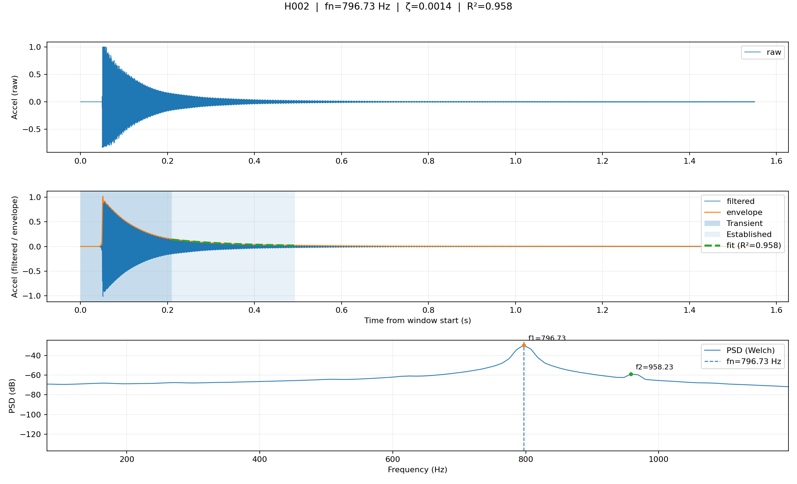
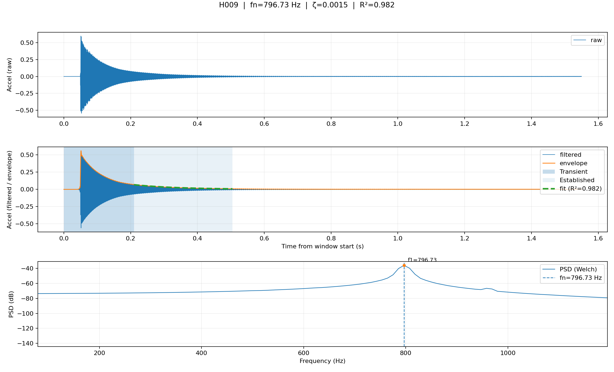
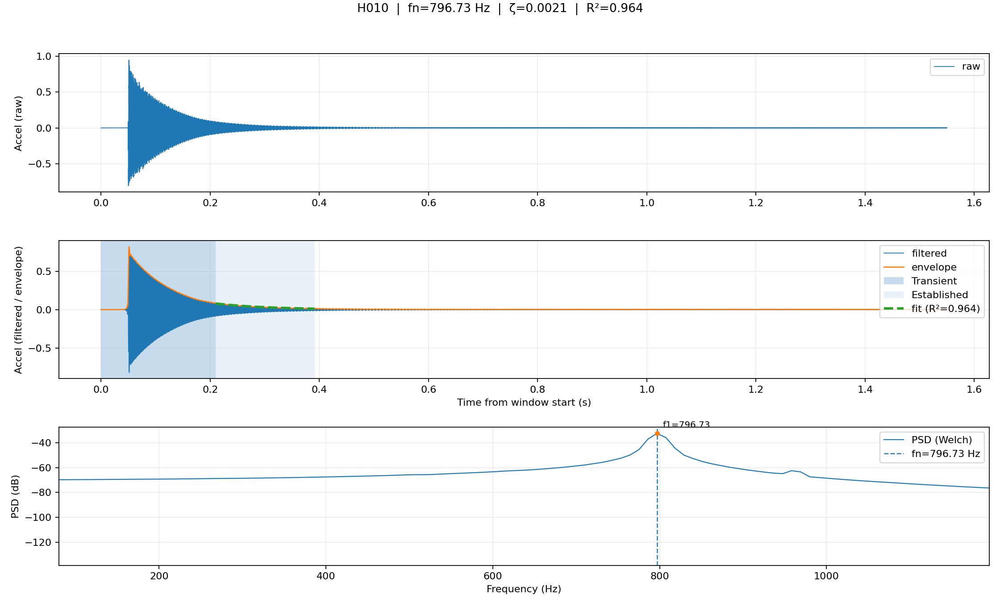
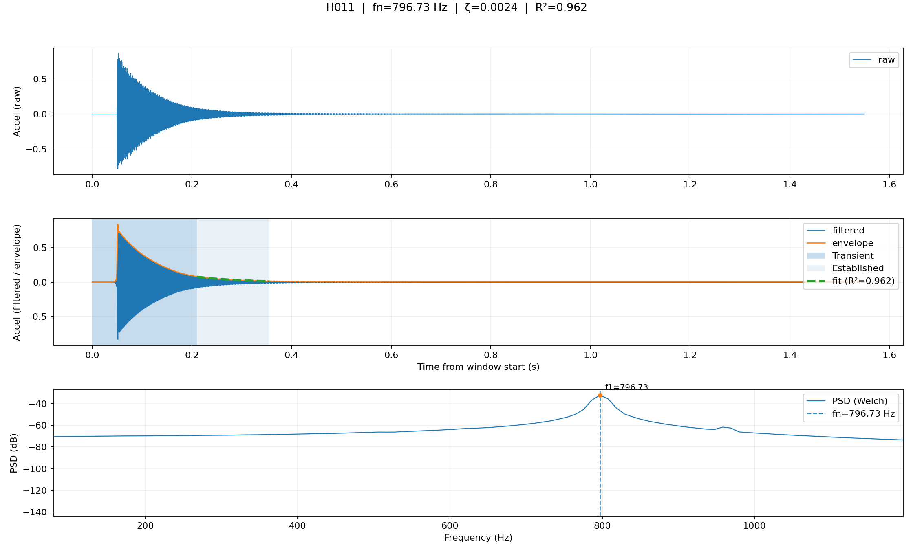
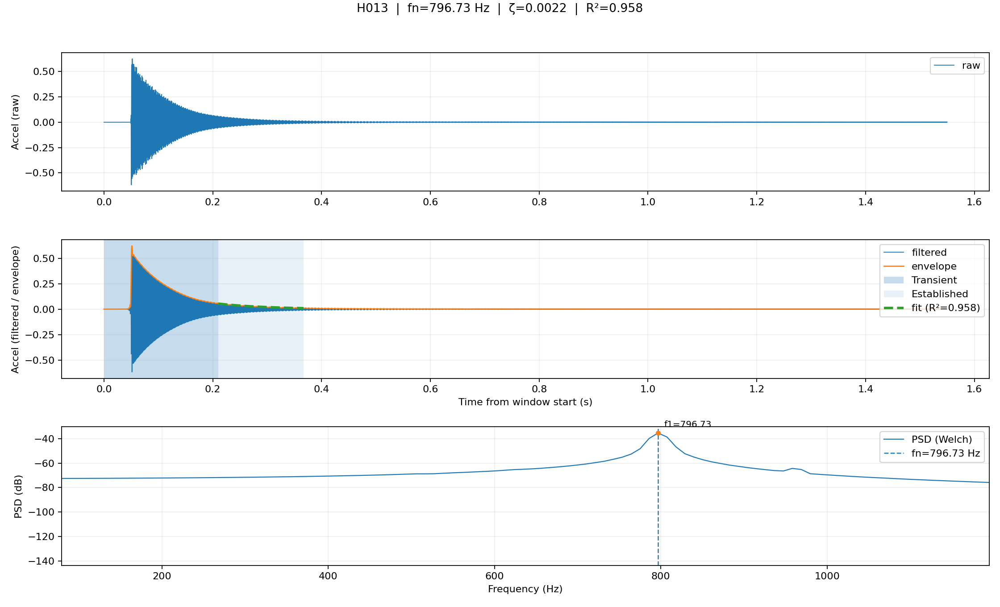

# Modal report

- Total hits: **13**
- Accepted: **13**
- Rejected: **0**

## Accepted summary

- fn (Hz): mean=796.729, min=796.729, max=796.729
- zeta: mean=0.001609, min=0.001148, max=0.002424
- SNR (dB): mean=40.02, min=37.85, max=47.53
- Envelope fit R²: mean=0.973, min=0.958, max=0.992

## Hit-by-hit

### H001

- fn=796.729 Hz
- zeta=0.001163
- SNR=37.85 dB
- R²=0.984

### H002

- fn=796.729 Hz
- zeta=0.001381
- SNR=38.13 dB
- R²=0.958

### H003

- fn=796.729 Hz
- zeta=0.001247
- SNR=38.61 dB
- R²=0.979

### H004

- fn=796.729 Hz
- zeta=0.001454
- SNR=41.34 dB
- R²=0.972

### H005

- fn=796.729 Hz
- zeta=0.001148
- SNR=38.37 dB
- R²=0.992

### H006

- fn=796.729 Hz
- zeta=0.001532
- SNR=38.75 dB
- R²=0.969

### H007

- fn=796.729 Hz
- zeta=0.001587
- SNR=37.92 dB
- R²=0.961

### H008

- fn=796.729 Hz
- zeta=0.001367
- SNR=42.03 dB
- R²=0.981

### H009

- fn=796.729 Hz
- zeta=0.001515
- SNR=40.88 dB
- R²=0.982

### H010

- fn=796.729 Hz
- zeta=0.002053
- SNR=39.96 dB
- R²=0.964

### H011

- fn=796.729 Hz
- zeta=0.002424
- SNR=39.59 dB
- R²=0.962

### H012

- fn=796.729 Hz
- zeta=0.001855
- SNR=47.53 dB
- R²=0.982

### H013

- fn=796.729 Hz
- zeta=0.002185
- SNR=39.28 dB
- R²=0.958

