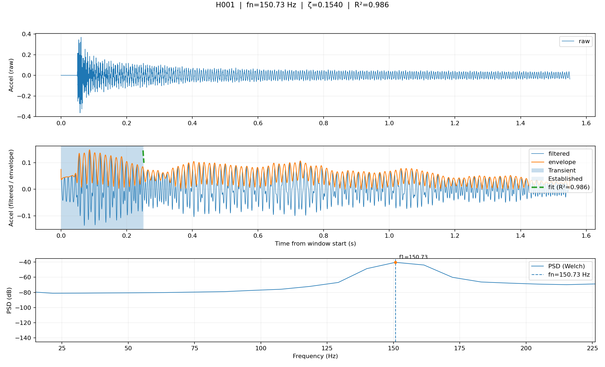
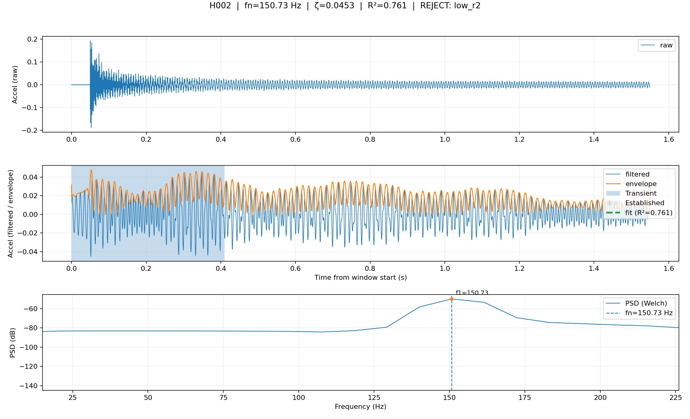
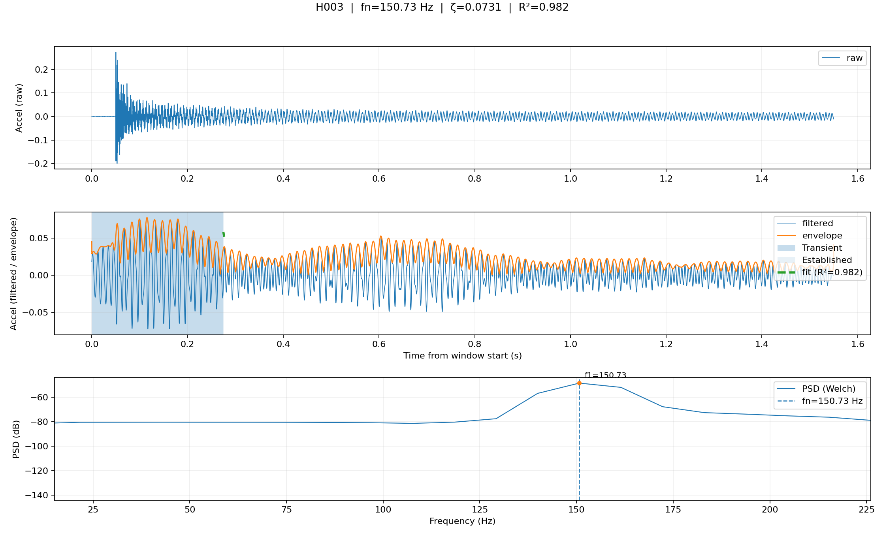
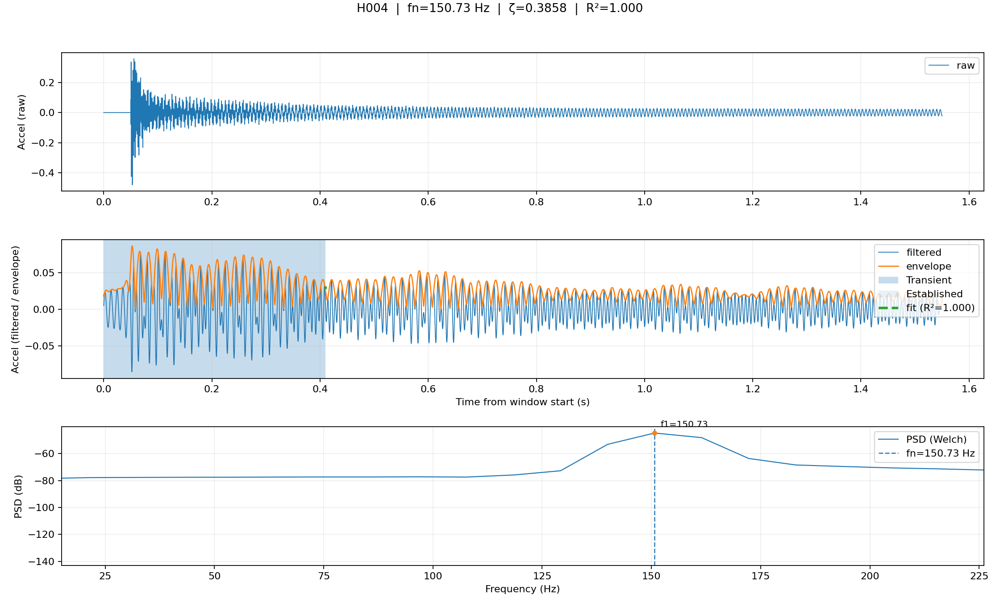
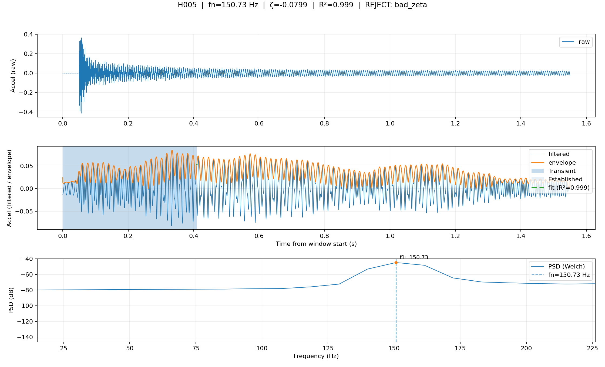
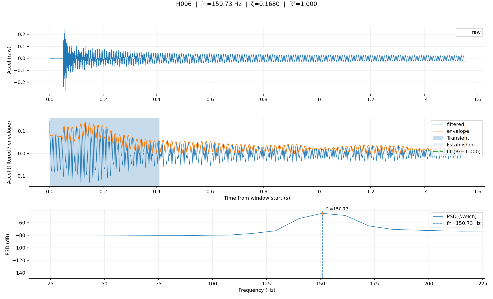
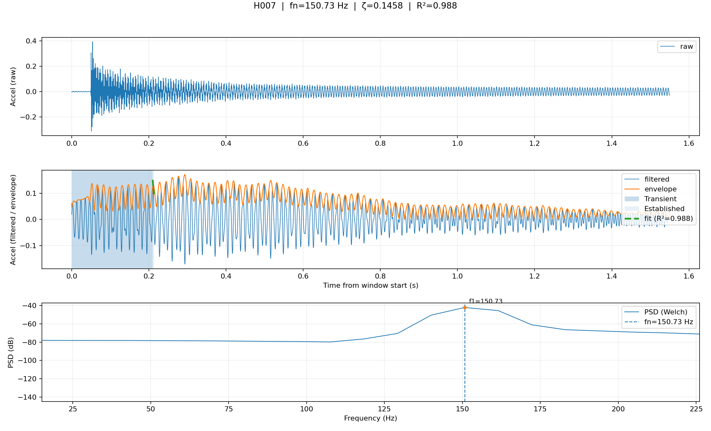
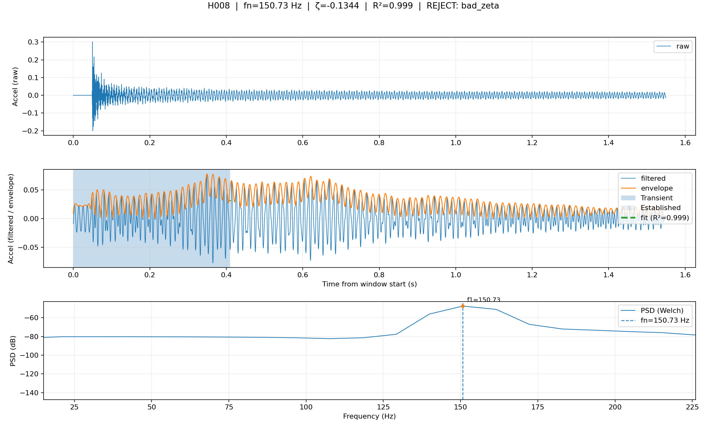
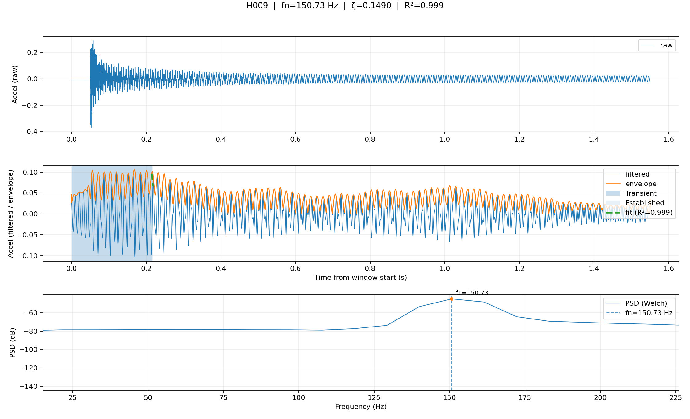

# Modal report

- Total hits: **9**
- Accepted: **6**
- Rejected: **3**

## Accepted summary

- fn (Hz): mean=150.732, min=150.732, max=150.732
- zeta: mean=0.179290, min=0.073080, max=0.385783
- SNR (dB): mean=8.81, min=7.62, max=10.59
- Envelope fit R²: mean=0.992, min=0.982, max=1.000

## Rejections (by reason)

- bad_zeta: 2
- low_r2: 1

## Hit-by-hit

### H001

- fn=150.732 Hz
- zeta=0.154035
- SNR=8.69 dB
- R²=0.986

### H002

- fn=150.732 Hz
- zeta=0.045250
- SNR=8.93 dB
- R²=0.761
- reject_reason: `low_r2`

### H003

- fn=150.732 Hz
- zeta=0.073080
- SNR=8.32 dB
- R²=0.982

### H004

- fn=150.732 Hz
- zeta=0.385783
- SNR=10.59 dB
- R²=1.000

### H005

- fn=150.732 Hz
- zeta=-0.079907
- SNR=10.89 dB
- R²=0.999
- reject_reason: `bad_zeta`

### H006

- fn=150.732 Hz
- zeta=0.168035
- SNR=7.62 dB
- R²=1.000

### H007

- fn=150.732 Hz
- zeta=0.145806
- SNR=8.63 dB
- R²=0.988

### H008

- fn=150.732 Hz
- zeta=-0.134354
- SNR=6.67 dB
- R²=0.999
- reject_reason: `bad_zeta`

### H009

- fn=150.732 Hz
- zeta=0.148998
- SNR=8.99 dB
- R²=0.999

