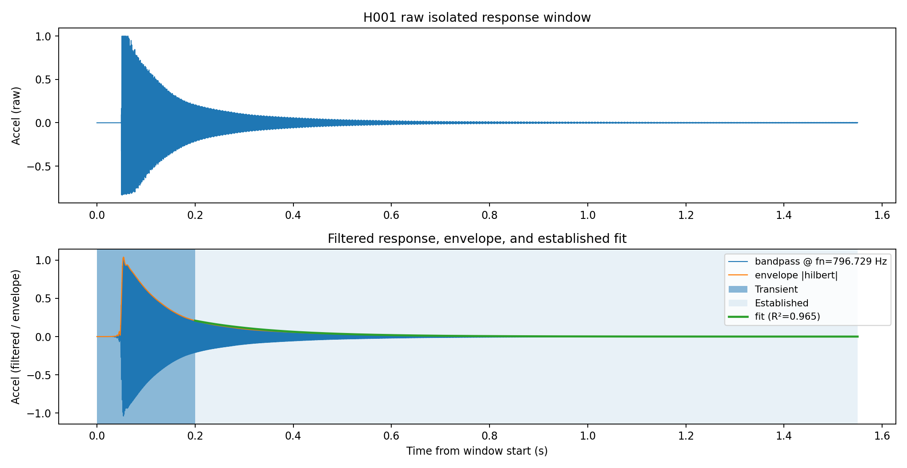
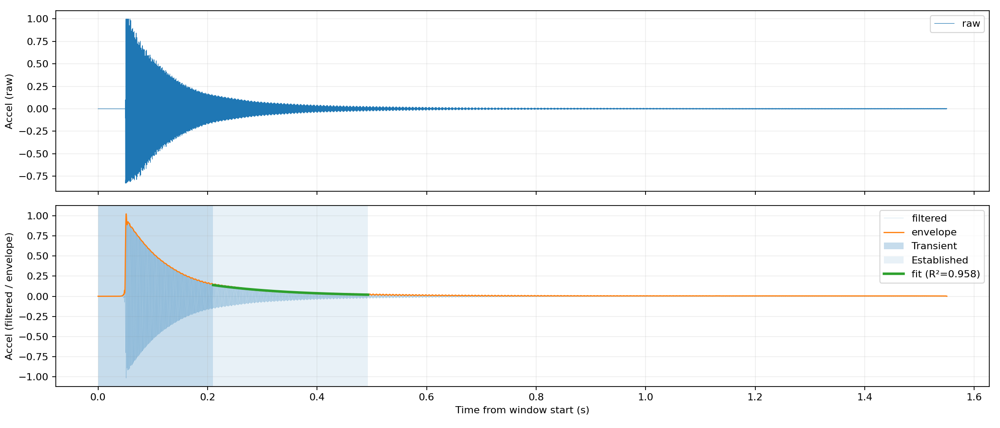
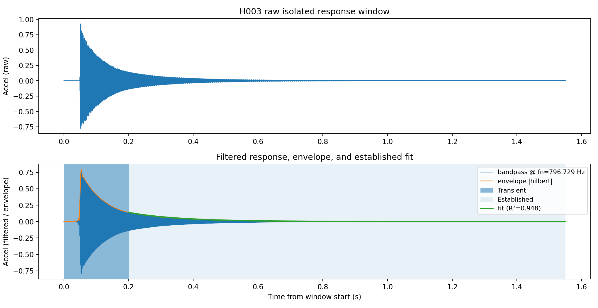
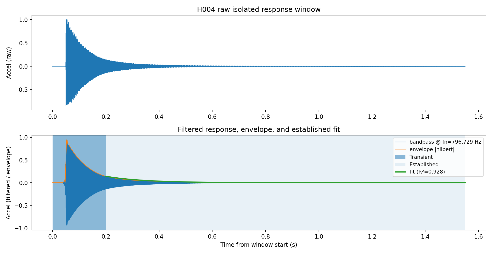
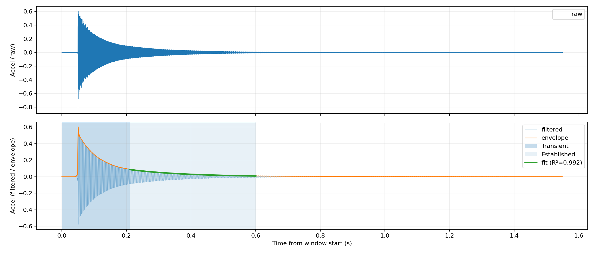
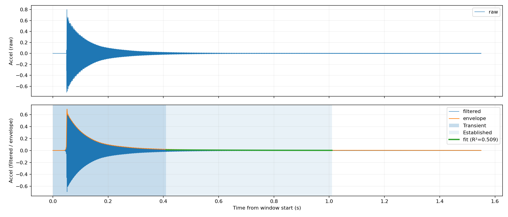
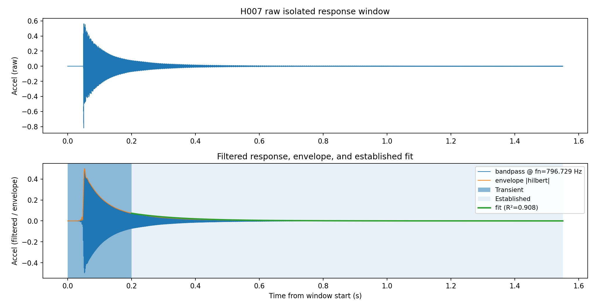
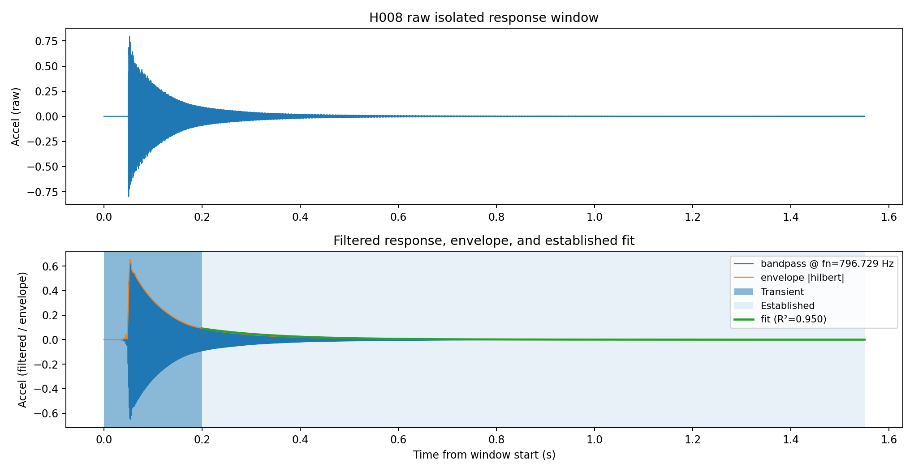
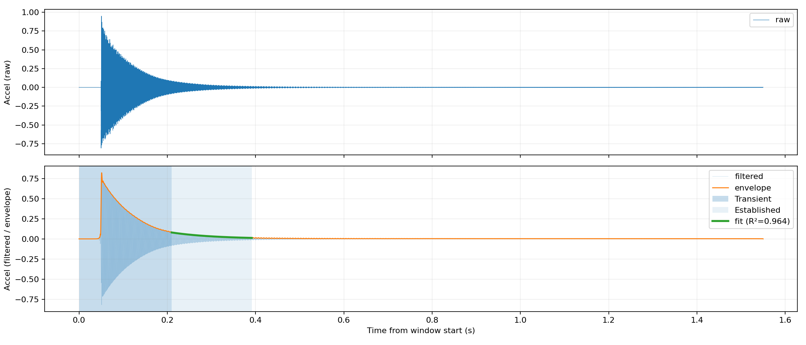
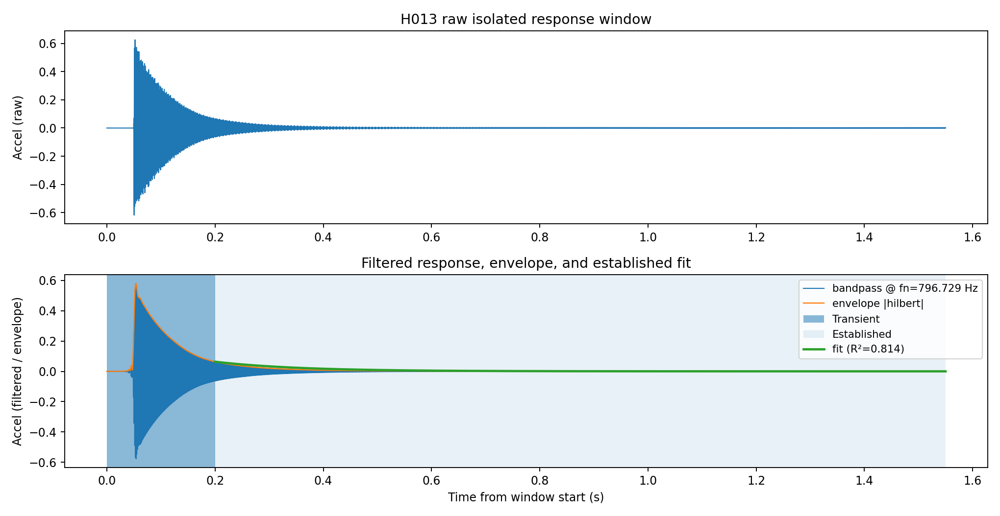

# Smoke test - modal extraction

- Total hits: **13**
- Accepted: **1**
- Rejected: **12**

## Accepted summary

- fn (Hz): mean=796.729, min=796.729, max=796.729
- zeta: mean=0.001020, min=0.001020, max=0.001020
- SNR (dB): mean=38.37, min=38.37, max=38.37
- Envelope fit R²: mean=0.950, min=0.950, max=0.950

## Rejections (by reason)

- low_r2: 12

## Hit-by-hit

### H001

- fn=796.729 Hz
- zeta=0.000917
- SNR=37.85 dB
- R²=0.803
- reject_reason: `low_r2`

### H002

- fn=796.729 Hz
- zeta=0.000691
- SNR=38.13 dB
- R²=0.605
- reject_reason: `low_r2`

### H003

- fn=796.729 Hz
- zeta=0.000877
- SNR=38.61 dB
- R²=0.698
- reject_reason: `low_r2`

### H004

- fn=796.729 Hz
- zeta=0.000726
- SNR=41.34 dB
- R²=0.616
- reject_reason: `low_r2`

### H005

- fn=796.729 Hz
- zeta=0.001020
- SNR=38.37 dB
- R²=0.950

### H006

- fn=796.729 Hz
- zeta=0.000559
- SNR=38.75 dB
- R²=0.509
- reject_reason: `low_r2`

### H007

- fn=796.729 Hz
- zeta=0.000514
- SNR=37.92 dB
- R²=0.470
- reject_reason: `low_r2`

### H008

- fn=796.729 Hz
- zeta=0.000887
- SNR=42.03 dB
- R²=0.743
- reject_reason: `low_r2`

### H009

- fn=796.729 Hz
- zeta=0.000720
- SNR=40.88 dB
- R²=0.606
- reject_reason: `low_r2`

### H010

- fn=796.729 Hz
- zeta=0.000246
- SNR=39.96 dB
- R²=0.233
- reject_reason: `low_r2`

### H011

- fn=796.729 Hz
- zeta=0.000125
- SNR=39.59 dB
- R²=0.101
- reject_reason: `low_r2`

### H012

- fn=796.729 Hz
- zeta=0.000657
- SNR=47.53 dB
- R²=0.558
- reject_reason: `low_r2`

### H013

- fn=796.729 Hz
- zeta=0.000152
- SNR=39.28 dB
- R²=0.127
- reject_reason: `low_r2`

