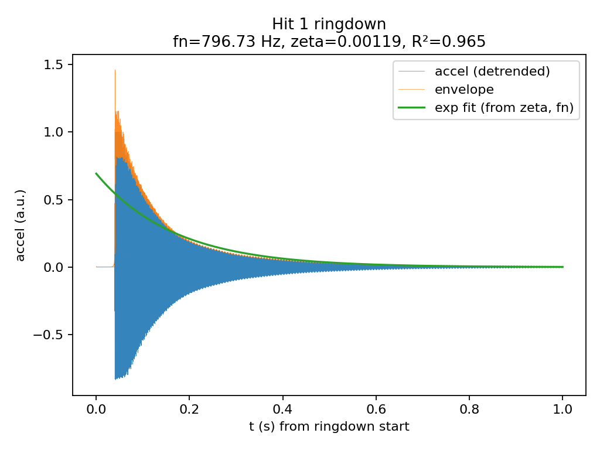

# Smoke test - modal extraction

## Hit-by-hit results

Per-hit extracted values (one row per detected impact).

| hit_id | t_hit (s) | f_n (Hz) | zeta | SNR (dB) | env R² | reject |
| --- | --- | --- | --- | --- | --- | --- |
| H001 | 3.716 | 796.73 | 0.00119 | 37.8 | 0.965 |  |
| H002 | 14.712 | 796.73 | 0.00130 | 38.1 | 0.923 |  |
| H003 | 26.501 | 796.73 | 0.00128 | 38.6 | 0.948 |  |
| H004 | 36.810 | 796.73 | 0.00140 | 41.3 | 0.928 |  |
| H005 | 46.383 | 796.73 | 0.00118 | 38.4 | 0.978 |  |
| H006 | 53.378 | 796.73 | 0.00134 | 38.8 | 0.913 |  |
| H007 | 60.865 | 796.73 | 0.00131 | 37.9 | 0.908 |  |
| H008 | 69.227 | 796.73 | 0.00133 | 42.0 | 0.950 |  |
| H009 | 76.268 | 796.73 | 0.00140 | 40.9 | 0.931 |  |
| H010 | 83.006 | 796.73 | 0.00136 | 40.0 | 0.844 |  |
| H011 | 91.713 | 796.73 | 0.00132 | 39.6 | 0.797 |  |
| H012 | 99.304 | 796.73 | 0.00163 | 47.5 | 0.921 |  |
| H013 | 105.870 | 796.73 | 0.00131 | 39.3 | 0.814 |  |

## Summary

Detected hits: **13**. Accepted for summary: **13**.

| metric | median | IQR |
| --- | --- | --- |
| f_n (Hz) | 796.73 | 0.00 |
| zeta | 0.00132 | 0.00006 |

## Per-hit deep dive

### Hit 1

- t_hit=3.716s  - fn=796.73Hz  - zeta=0.00119  - SNR=37.8dB  - R²=0.965  - reject=OK

