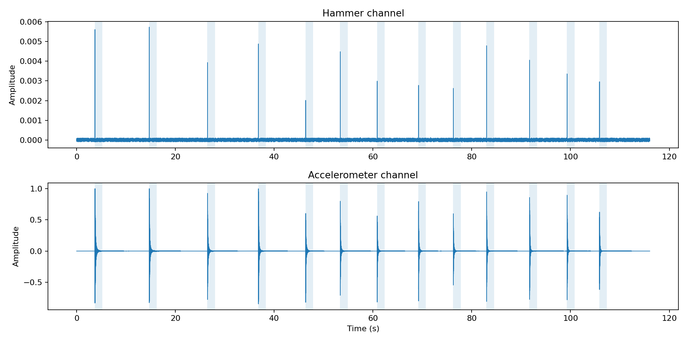

# WAV preprocessing (smoke test)

## WAV file specs

| Field | Value |
| --- | --- |
| Path | /home/placerte/projects/wav-to-freq/media/hit 251212-2.wav |
| Sample rate (Hz) | 44100.000 |
| Samples | 5117496 |
| Duration (s) | 116.042993 |
| Hammer channel | StereoChannel.LEFT |
| Autodetect method | kurtosis_hp200 |
| Autodetect score (left) | 4220.3 |
| Autodetect score (right) | 208.342 |
| Autodetect confidence hi/lo | 20.3 |

## Hit detection summary

| Metric | Value |
| --- | --- |
| Hits found | 13 |
| Hits used | 13 |
| Threshold (abs) | 3.20572e-05 |
| Min separation (s) | 0.3 |
| Window pre (s) | 0.05 |
| Window post (s) | 1.5 |

## Raw parameters (traceability)

```text
hammer_channel=<StereoChannel.LEFT: 'left'>
n_hits_found=13
n_hits_used=13
threshold=3.205724246664991e-05
min_separation_s=0.3
pre_s=0.05
post_s=1.5
```

Overview (hammer on top, response on bottom), aligned in time:


